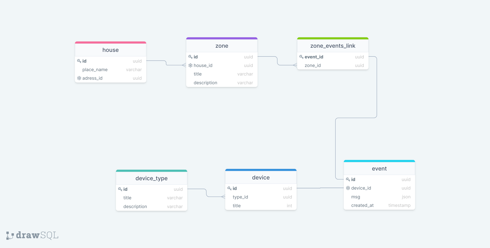

### Домашнее задание

*База данных будет хранить в себе информацию о умных домах, их зонах (комнатах),
устройствах, которые расположены в зонах, и событиях которые генерируют эти устройства.
События представлены сообщениями в JSON формате. Каждый девайс имеет свой тип и определяется справочником.
 Кастаельно репликации - я бы выбрал физическую репликацию данных, как самую простую. Начал бы ознакомление с этого.*

---
