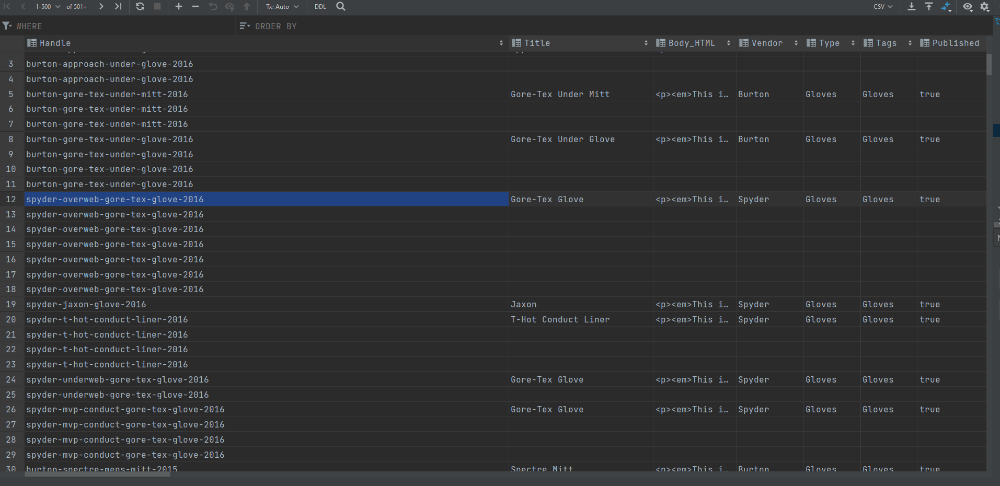

### Домашнее задание 11

#### Транзакции

docker-compose к БД находится в [домашнем задании 9](../homework_9)
Выполнить [data.sql](data.sql) и можно смотреть запросы [queries.sql](queries.sql)
Результат загрузки LOAD DATA в [скриншоте](data_loaded.png)
