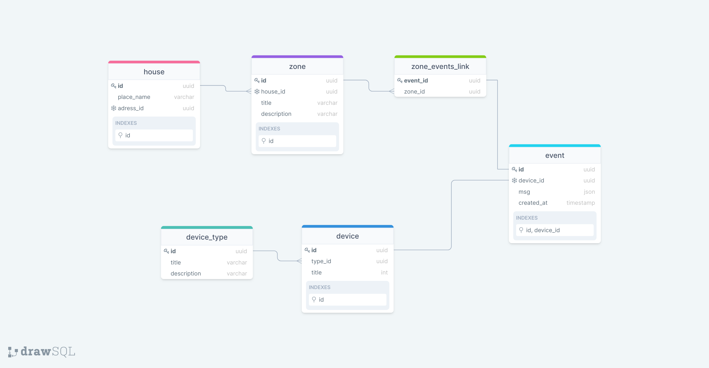

### Домашнее задание

*Добавил [.sql](schema.sql) файл для построения схемы.
Отражены констрейнты и индексы.
индексы по id на house,zone,device - это основные сущности в 
нашей базе данных, запросы почти всегда будут идти через эти таблицы.
Составной индекс на таблице event - этих событий будет очень много от разных устройств. 
Индекс на таблице event - created_at - нужен для получения всех событий за какой либо конкретный период времени.*

*Обновлена [визуальная диаграмма](DbDiagram.png)*

---

