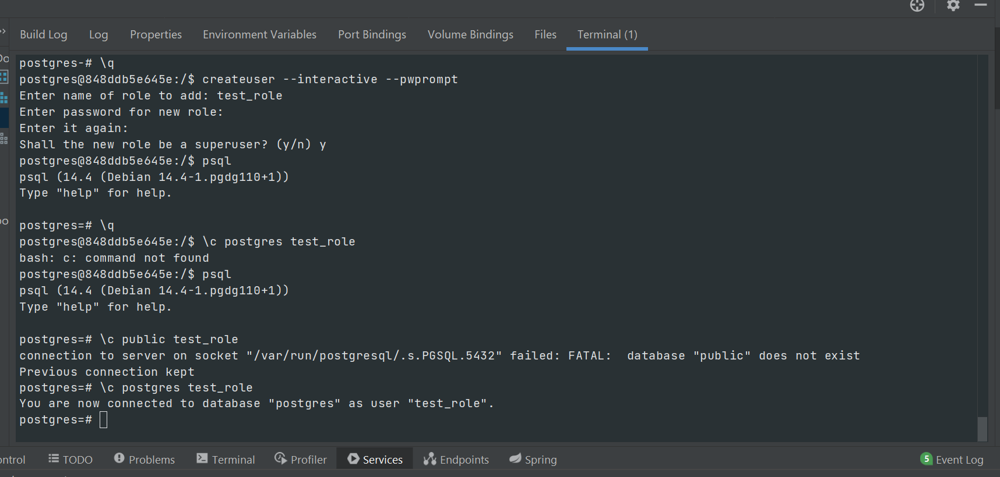
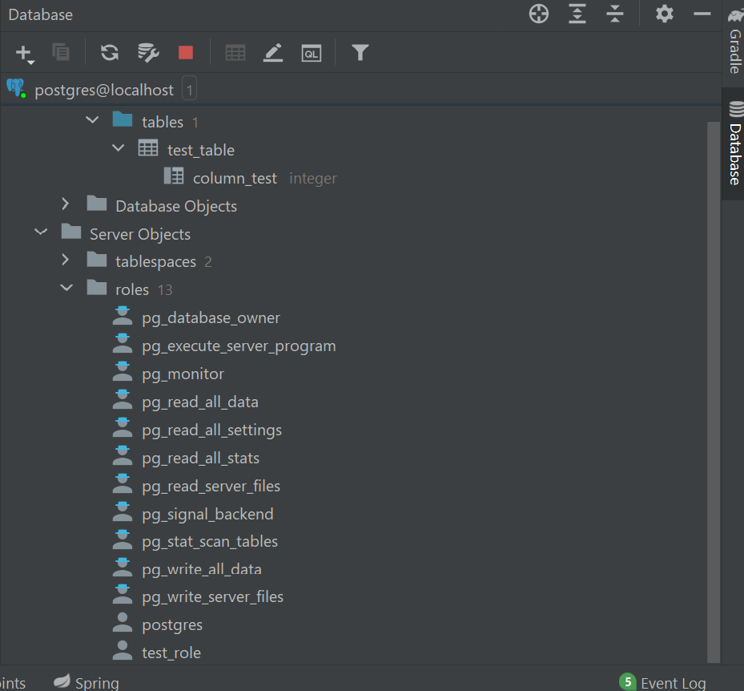

### Домашнее задание

*Поднял контейнер с postgres 14, добавил пользователя через консоль, подключился через Intellij Idea
на скриншоте показан процесс создания пользователя и успешное подключение, в котором видно нового пользователя test_role*

